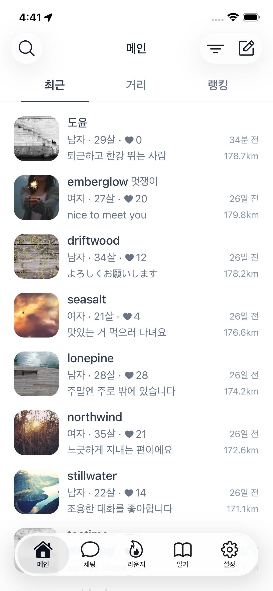
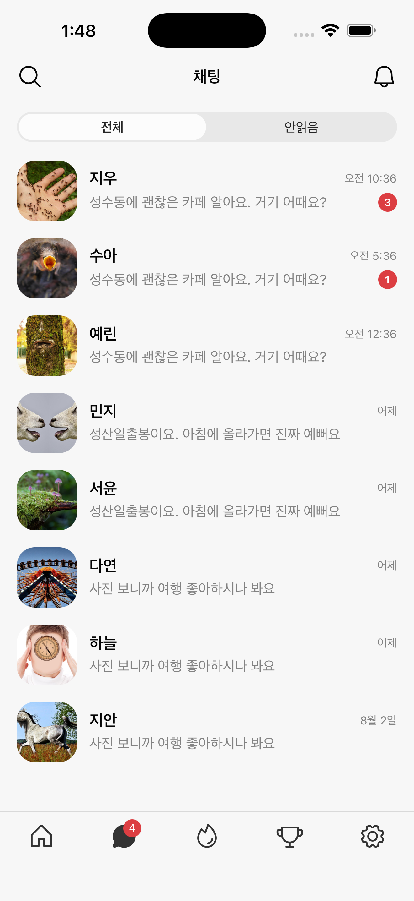
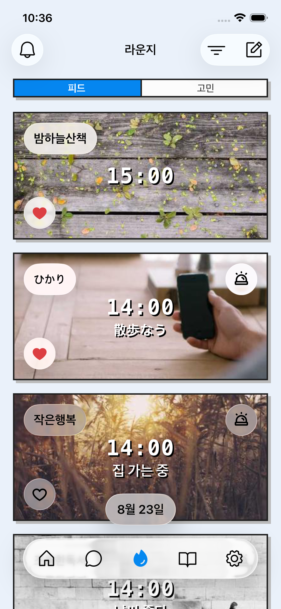
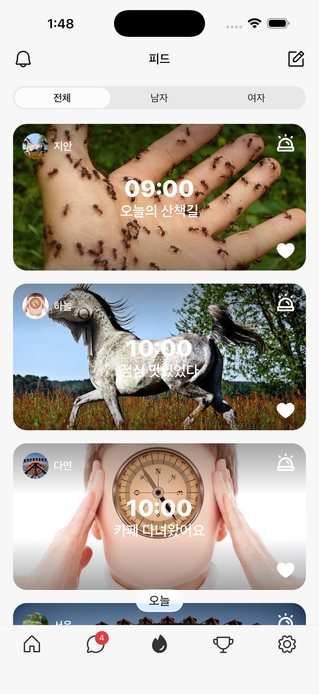
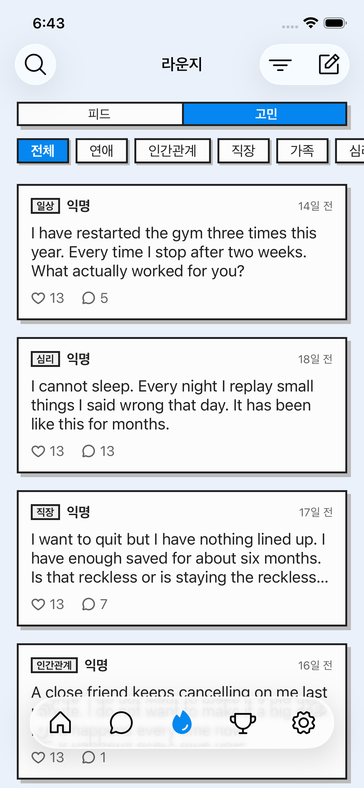
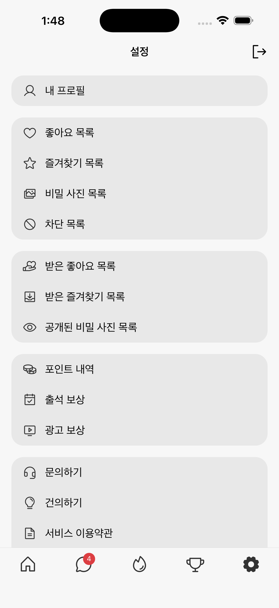
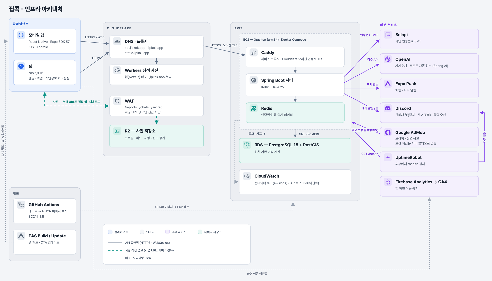

[](https://github.com/blueoauld/jipkok/actions/workflows/app-check.yml)
[](https://github.com/blueoauld/jipkok/actions/workflows/app-update.yml)
[](https://github.com/blueoauld/jipkok/actions/workflows/server-deploy.yml)

# 집콕

가까운 거리의 사람들과 쪽지로 대화를 시작하는 위치 기반 채팅 서비스입니다. 한국, 일본, 대만에서 가입할 수 있고 한국어, 일본어, 중국어(번체), 영어를 지원합니다. 기획부터 서버, 앱, 어드민, 인프라까지 혼자 만들어 [App Store](https://apps.apple.com/app/id6795136181)와 [Google Play](https://play.google.com/store/apps/details?id=com.blueoauld.jipkok)에 출시했습니다.

- **서버** - Kotlin 2.3, Spring Boot 4.1, Java 25, PostgreSQL 18 + PostGIS, Redis, Flyway, Testcontainers
- **앱** - React Native, Expo SDK 57, TanStack Query, STOMP
- **웹, 어드민** - Next.js 16
- **인프라** - AWS EC2 (Graviton), RDS, Cloudflare (R2, Workers, WAF, Access), GitHub Actions, Docker Compose

## 화면

|  |  |  |  |  |  |
| ----------------------- | ----------------------- | ----------------------- | ----------------------- | ----------------------- | ----------------------- |
| **메인**                | **채팅**                | **피드**                | **고민**                | **일기**                | **설정**                |

## 아키텍처



모든 요청은 Cloudflare를 거쳐 EC2의 Caddy로 들어가고, Caddy가 Spring Boot 서버로 넘깁니다. 서버는 Docker Compose로 Caddy, 애플리케이션, Redis 세 컨테이너를 띄우고 데이터베이스는 RDS를 씁니다. 사진과 동영상은 서버를 거치지 않고 R2와 직접 주고받습니다. 채팅은 STOMP over WebSocket으로 주고받습니다.

### 코드 구조

한 저장소에 `server/`(Spring Boot API), `app/`(React Native), `admin/`(운영 홈페이지), `web/`(기본 홈페이지) 네 프로젝트가 있습니다.

서버는 도메인 우선으로 나눕니다. `domain/` 아래 25개 도메인(member, chat, feed, worry, diary, ai, report, suspension, point 등)이 각각 `web`, `service`, `repository`, `entity`, `dto`를 갖고, `global/`에는 도메인을 모르는 공통 계층(보안, 저장소, 디스코드, 설정)만 둡니다. 의존 방향이 무너지지 않도록 세 가지 규칙을 지킵니다.

- **`global`은 `domain`을 import하지 않습니다.** 도메인 이벤트 리스너는 디스코드로 보내는 것이라도 그 도메인의 `service`에 둡니다.
- **admin 전용 쿼리는 `admin/repository`에 둡니다.** 목록과 통계 쿼리가 도메인 리포지토리에 섞이면 도메인이 admin을 알게 됩니다.
- **admin의 쓰기 작업은 도메인 서비스에 위임합니다.** 도메인의 삭제 규칙과 어긋나지 않게 하고, 모든 조치는 행위자와 함께 `admin_action` 테이블에 남깁니다.

**API 계약은 커밋된 스냅샷으로 관리합니다.** springdoc이 만드는 OpenAPI 문서를 `app/openapi.json`과 `admin/openapi.json`으로 저장소에 두고, 클라이언트는 openapi-typescript로 타입을 생성합니다. 서버 문서와 스냅샷이 어긋나면 테스트가 실패하므로, API를 바꿔놓고 클라이언트 타입을 낡은 채 두는 실수가 커밋 단계에서 잡힙니다.

## 성능 개선

회원 목록이 서비스의 첫 화면이라 여기가 느리면 전부 느리게 느껴집니다. 운영과 같은 RDS에 100만 건을 넣고 측정했습니다.

| 조회          | 개선 전 | 개선 후 | 개선율 |
| ------------- | ------- | ------- | ------ |
| 최신순        | 1192ms  | 6ms     | 99.5%  |
| 인기순        | 1173ms  | 40ms    | 96.6%  |
| 거리순        | 2897ms  | 120ms   | 95.9%  |
| 최신순 + 성별 | 1327ms  | 505ms   | 61.9%  |
| 닉네임 검색   | 930ms   | 351ms   | 62.3%  |

**인덱스만으로는 최신순과 거리순이 전혀 빨라지지 않았습니다.** 최신순은 커서 비교와 정렬에 `extract(epoch from located_at)`를 쓰고 있어, 플래너가 `located_at desc` 인덱스와 같은 순서라는 것을 알지 못하고 100만 행을 다시 정렬했습니다. 비교와 정렬을 모두 컬럼 자체로 바꾸자 1192ms가 6ms가 됐습니다. 거리순은 `st_distancesphere`로 계산한 값을 정렬에 쓰고 있어 모든 행을 계산해야 했습니다. PostGIS의 KNN 연산자(`<->`)로 정렬을 바꿔 GiST 인덱스가 가까운 순서대로 훑도록 했습니다. geography의 `<->`는 `st_distancesphere`와 같은 구면 계산이라 응답에 담는 거리값과 정렬 순서가 어긋날 일이 없습니다.

```sql
order by geography(st_makepoint(m.longitude, m.latitude))
    <-> geography(st_makepoint(:longitude, :latitude)) asc
```

**채팅방, 고민, 피드 목록도 정렬 키가 인덱스를 벗어나 있었습니다.** 한 페이지 20건을 꺼내려고 필터에 맞는 행을 전부 읽어 정렬한 뒤 버리고 있었습니다. 채팅방은 회원 1만, 방 10만, 메시지 100만 건, 고민은 10만 건, 피드는 15만 건을 넣고 반복 평균으로 쟀습니다. 숫자 자체는 작지만, 비용이 데이터 양에 비례하지 않게 된 것이 이 개선의 의미입니다.

| 조회                | 개선 전 | 개선 후 | 조치                                                                                 |
| ------------------- | ------- | ------- | ------------------------------------------------------------------------------------ |
| 채팅방 목록         | 0.52ms  | 0.02ms  | 마지막 메시지를 방 멤버 쪽에 비정규화하고 `(member_id, last_message_id desc)` 인덱스 |
| 고민 공감순, 댓글순 | 4.86ms  | 0.01ms  | 정렬용 복합 인덱스. 기본 정렬인 최신순은 쓰기 비용만 늘어 넣지 않음                  |
| 피드 목록           | 6.89ms  | 0.05ms  | 인덱스 추가 없이 정렬을 `slot_at desc, id desc`로 바꿔 기존 인덱스를 타게 함         |

## 설계 결정

**사진은 서버를 거치지 않습니다** - 서버는 서명된 URL만 발급합니다. 이미지가 서버 메모리와 대역폭을 쓰지 않아 EC2 한 대로 버틸 수 있고, 비공개 사진은 Cloudflare WAF 규칙으로 서명 없는 접근을 막았습니다. 서명된 PUT URL은 크기를 제한하지 못하고 R2는 presigned POST를 지원하지 않으므로, 키를 확정하는 시점에 저장소에 크기를 물어 상한을 넘으면 객체를 지우고 거절합니다.

**익명 게시판에는 차단 필터를 일부러 걸지 않았습니다** - 차단 목록으로 글을 걸러주면 차단 전후의 목록을 비교해 글쓴이를 알아낼 수 있습니다. 같은 이유로 익명 번호는 지운 댓글까지 세어 번호가 앞으로 당겨지지 않게 했습니다.

**신고 정책은 게시판마다 다르게 잡았습니다** - 피드 게시물과 고민 댓글은 다섯 번 신고되면 자동으로 지웁니다. 고민 글은 잘못 지우면 되돌릴 수 없으므로 알림만 보내고 삭제는 운영자가 판단합니다. 신고는 접수 시점의 프로필, 사진, 대화를 스냅샷으로 남겨 탈퇴하거나 방을 나가도 증거가 사라지지 않습니다.

**어뷰징 제한은 Redis 윈도우 카운터 하나로 통일했습니다** - `INCR` 뒤 첫 호출에만 `EXPIRE`를 거는 Lua 스크립트를 공용 헬퍼로 두고, 로그인 시도, 인증번호 발송, 번역 횟수가 모두 이것을 씁니다. 로그인은 CGNAT를 고려해 번호당 5회, IP당 30회로 다르게 걸었고, 확인을 BCrypt 앞에 두어 한도를 넘으면 해시 검증을 하지 않습니다. 인증번호 발송에는 하루 500건의 전체 상한을 하나 더 두어 분산 IP 과금 공격의 최악 손해를 하루치 SMS 비용으로 잘랐습니다.

**트랜잭션 안에서 외부를 호출하지 않습니다** - R2 복사, Expo 푸시, OpenAI 검수가 트랜잭션 안에 있어 커넥션 10개짜리 풀을 외부 왕복 동안 물고 있었습니다. 되돌릴 수 없는 작업이라 롤백 안전성도 얻지 못했습니다. 커밋을 먼저 하고 외부 작업을 뒤로 미뤘습니다. 실패해도 "있어야 할 것이 없다"로 남아 재시도할 수 있고, 반대 순서면 아무도 모르는 고아 객체가 남습니다.

**AI 계정은 별도 시스템이 아니라 회원 행입니다** - 회원이 적은 초기에 대화 상대가 되어 주는 운영 계정을 두었고, 자동으로 응답하는 계정이 있다는 것은 이용약관에 고지했습니다. 회원 테이블에 역할만 AI로 둔 행이라 목록, 차단, 신고, 즐겨찾기, 어드민 채팅 열람이 전부 그대로 동작하고 앱 코드는 바꾸지 않았습니다. 응답은 메시지 커밋 후 이벤트가 방당 한 행짜리 작업 큐에 upsert하고, 5초마다 도는 스케줄러가 판단, LLM 호출, 저장을 나눠 처리합니다. 연달아 온 메시지는 기한만 밀려 한 번에 답하고, LLM 호출은 트랜잭션 밖입니다. 답을 만드는 동안 새 메시지가 와도 놓치지 않도록 AI의 읽음 위치를 "답한 메시지까지"로 기록하고 그보다 새 메시지가 있을 때만 답합니다. 여자 신규 회원에게는 가입 뒤 가까운 남자 AI가 먼저 쪽지를 보냅니다. 회원당 한 번, 가입 후 3일 안에만이고, 전송은 일반 쪽지 경로를 그대로 타되 AI가 발신자면 포인트를 차감하지 않습니다.

**LLM 비용은 프롬프트 순서로 줄였습니다** - 시스템 메시지에서 규칙, 페르소나, 자기 프로필처럼 AI마다 고정인 부분을 앞에, 상대 프로필과 시각처럼 매번 다른 부분을 뒤에 두어 OpenAI 프롬프트 캐시가 앞부분에 걸리게 했습니다. 대화 문맥은 최신부터 1,500자, 자기소개는 200자로 잘라 입력 토큰이 비용의 대부분인 구조에서 상한을 고정했습니다. 응답마다 토큰 수를 기록해 어드민에서 계정별 비용을 보고, 방당, 계정당, 전체 하루 한도로 폭주를 막습니다.

**탈퇴는 한 파일에 모으고 테스트로 지킵니다** - 지워야 할 데이터가 13개의 도메인에 걸쳐 있습니다. 도메인별 이벤트로 흩뿌리면 리스너 하나를 빠뜨려도 조용히 고아 데이터가 남습니다. 순서가 눈에 보이는 중앙 서비스를 유지하고, 모든 도메인에 데이터를 심은 회원을 탈퇴시켜 흔적이 남지 않는지 확인하는 통합 테스트를 붙였습니다.

## 테스트

1,041건이 돌고, 통과해야 배포됩니다. 153개 테스트 클래스 중 43개만 Testcontainers로 실제 PostgreSQL과 Redis를 띄워 검증하고 나머지는 목으로 의존성을 끊은 서비스 테스트입니다. 네이티브 SQL로 고쳐 쓴 목록 쿼리는 목으로 검증할 수 없으므로, 커서 페이징이 경계에서 빠뜨리거나 중복하지 않는지와 거리순 정렬이 실제 거리와 일치하는지를 DB에 데이터를 넣고 확인합니다.

**테스트 이름은 한글 문장으로 씁니다.** 무엇을 보장하는지가 이름만으로 읽히도록 했습니다. 시간은 `Clock`을 주입해 고정하므로 자정 근처에서만 실패하는 테스트가 없습니다.

```kotlin
fun `같은 번호로 오늘 이미 출석했으면 보상을 주지 않는다`()
fun `자기 자신에게는 좋아요를 누를 수 없다`()
fun `모든 도메인에서 회원의 흔적을 지운다`()
```

## 운영 자동화

**배포** - main에 푸시하면 린트와 테스트를 돌리고, 러너에서 jar를 만들어 arm64 이미지로 GHCR에 올린 뒤 EC2에서 교체합니다. 경로 필터를 걸어 서버가 바뀌지 않은 푸시에는 배포가 돌지 않고, graceful shutdown으로 처리 중인 요청을 끝내고 종료합니다.

**장애 감지** - 서버가 죽으면 UptimeRobot이 밖에서 `/health`를 확인해 디스코드로 알립니다. 액추에이터가 DB와 Redis 연결까지 확인하므로 의존 자원이 끊긴 상태도 잡힙니다. 에러 로그는 로그백 어펜더가 스택 트레이스와 함께 디스코드로 보냅니다. 그래서 응답에는 드러나지 않는 검수 실패나 푸시 실패도 잡힙니다. 디스코드 전송 실패가 다시 에러 로그를 만들지 않도록 디스코드 로거는 제외하고, 분당 5건까지만 보냅니다.

**정리와 기록** - 나간 채팅방, 삭제된 글, 탈퇴 회원, 접속 로그를 보존 기간이 지나면 새벽에 지웁니다. 전체 한도와 보존 기간은 [제약 조건](docs/제약-조건.md)에, 수사기관 요청 시 서류 등급과 조회 절차는 [수사 협조](docs/수사-협조.md)에 정리했습니다.

## 문제 해결 기록

**만료된 기기 토큰이 한 번도 지워지지 않고 있었습니다** - Expo가 알려준 토큰을 지우는 코드는 있었는데 반영되지 않았습니다. 채팅 푸시는 `AFTER_COMMIT` 리스너에서 보내는데, 그 시점에는 이미 커밋된 트랜잭션의 자원이 스레드에 그대로 묶여 있습니다. 그래서 `REQUIRED`로 들어간 삭제가 끝난 트랜잭션에 합류해 실행만 되고 버려졌습니다. 예외도 로그도 남지 않아 실제 DB로 재현 테스트를 써서 확인한 뒤, 쓰기 지점마다 `REQUIRES_NEW`를 명시하고 그 테스트를 회귀 테스트로 남겼습니다.

**`@Async`가 작업마다 새 스레드를 만들고 있었습니다** - WebSocket 메시징이 `Executor` 빈을 먼저 만들어 Boot가 기본 실행자 생성을 포기했고, `@Async`는 `SimpleAsyncTaskExecutor`로 떨어져 있었습니다. 푸시, 검수, 사진 복사가 전부 여기 얹혀 있었습니다. `@Async` 전용 `ThreadPoolTaskExecutor` 빈을 직접 정의해 셋이 같은 풀을 쓰게 했습니다.

**배포한 이미지가 EC2에서 실행되지 않았습니다** - EC2가 Graviton(arm64)인데 러너에서 빌드한 이미지는 amd64였습니다. 이미지 빌드를 `linux/arm64`로 지정했습니다. 컨테이너 헬스체크도 bash 내장 `/dev/tcp`가 Alpine에서 동작하지 않아 항상 실패하고 있어, HTTP로 `/health`를 두드리게 바꿨습니다.

## 앱

**화면과 상태** - Expo Router로 화면을 나누고, 서버 상태는 TanStack Query, 클라이언트 상태는 Zustand로 다룹니다.

**채팅** - STOMP와 REST를 함께 써서 실시간 수신과 커서 페이징을 한 스토어에서 맞춥니다.

**미디어** - 사진은 기기에서 WebP로 줄여 올리고, 동영상은 5분, 150MB 안으로 압축한 뒤 썸네일과 함께 보냅니다.

**일기** - 본인만 보는 하루 기록입니다. 사진과 동영상, 기분 이모지를 달력에 남기고 본문으로 검색합니다. 첨부는 공개 URL 없이 만료되는 서명 URL로만 내려주고, 지우면 보존 없이 바로 없앱니다.

**언어와 배포** - 네 언어를 i18next로 지원합니다. 타입 검사, 린트, Jest 312건이 CI에서 돌고, 배포는 EAS 빌드와 OTA 업데이트로 나갑니다.
